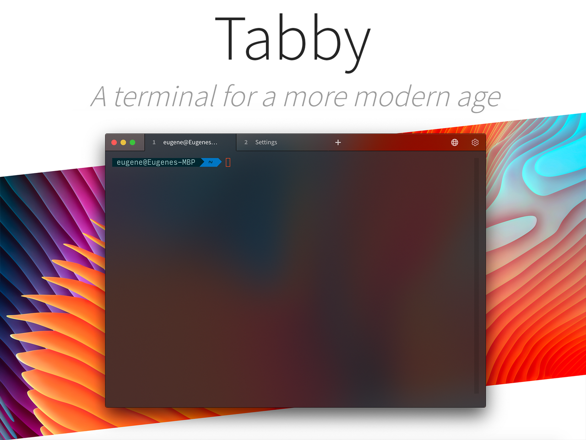
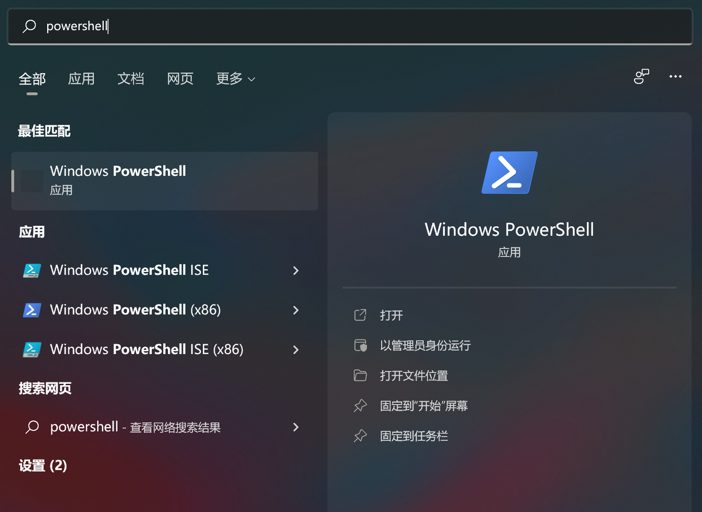
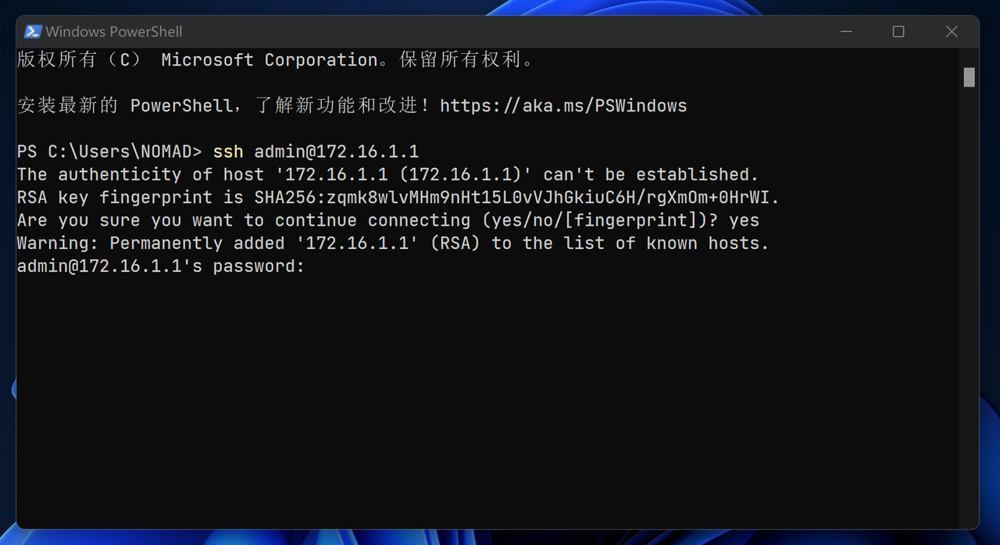

## 0.前景提要

在上一篇教程《[1.定义网络接口和基础配置](./1.定义网络接口和基础配置.md)》中，我们已经配置好了 RouterOS 的网络接口、DHCP、DNS等内容；  

此时，连接上 RouterOS 的设备可以正常获取到 IPv4 地址，但还不能正常访问外网。  

因为此时的 RouterOS 不仅关闭了 PPPoE 连接，而且还没有配置必要的防火墙设置。

## 1.工具准备

防火墙和流量整形的配置较为复杂，推荐使用 SSH 工具在 RouterOS 的命令行环境下进行配置。  

我目前常用的 SSH 工具是 [Tabby](https://github.com/Eugeny/tabby)，是一个基于 Electron 开发的开源跨平台终端工具，可以在 Github 平台上进行下载。



如果因为网络环境原因无法下载该软件时， Windows 系统自带的终端工具 `PowerShell` 也能一用。  

只需要在系统自带搜索中搜索“PowerShell”即可：



打开一个终端工具，输入以下命令：



```bash
## SSH 连接 RouterOS
ssh admin@172.16.1.1

## 询问是否保存秘钥
yes
```

然后输入 RouterOS 的密码进行登录。  

输入密码时不会有输入内容的提示，密码输入完后直接回车即可。登录成功后如图所示：


## 2.定义接口组

在配置防火墙之前，需要定义接口组。接口组可以简化防火墙的配置，并且在后续使用 RouterOS 的过程中如果对接口进行了修改而不必更新防火墙条目。  

在之前的教程中已经设置好的接口有 `pppoe-out1` 、`bridge1` 和 `ether1` ，分别代表连接互联网的接口 `WAN`、内网接口 `LAN` 以及访问光猫接口 `MODEN` 。  

### 2.1.RouterOS 拨号时

 **对于使用 RouterOS 拨号的场景** ，将以下命令一次性全部粘贴到终端工具中即可：

```bash
/interface list
add name=WAN comment="defconf: Connect To Global"
add name=LAN comment="defconf: Local Bridge"
add name=MODEM comment="modemconf: Access To Modem"

/interface list member
add interface=pppoe-out1 list=WAN comment="defconf: Connect To Global"
add interface=bridge1 list=LAN comment="defconf: Local Bridge"
add interface=ether1 list=MODEM comment="modemconf: Access To Modem"
```

如果这段代码不好复制，请查阅文件 [Fox_ROS_Define_Interfaces.conf](./src/Fox_ROS_Define_Interfaces.conf) 进行复制。  

在复制粘贴命令到终端工具并执行时，有时候会出现 **光标** 停留在全部命令的 **“最后一行”** 的情况：


这种情况下，命令的 **“最后一行”** 其实并未执行，我们需要手动按下 **“回车”** 键（多按几次当然也可以），以保证命令的全部执行，**该方法后文部分将不再赘述** ：


### 2.2.光猫拨号时

 **对于使用光猫拨号的场景** ，则 `ether1` 为 `WAN` ，则应该使用以下命令：

```bash
/interface list
add name=WAN comment="defconf: Connect To Global"
add name=LAN comment="defconf: Local Bridge"

/interface list member
add interface=ether1 list=WAN comment="defconf: Connect To Global"
add interface=bridge1 list=LAN comment="defconf: Local Bridge"
```

命令执行完毕后，打开 Winbox 并点击左侧导航的 `Interfaces` ，切换到 `Interface List` 选项卡，查看接口组内容：


其中 `pppoe-out1` 显示为斜体，这是因为该接口此时处于“禁用状态”，无需担心。


## 3.配置防火墙

防火墙配置内容包括 `address-list` 、`filter` 、`nat` 、`mangle` 、`raw` 以及一些和防火墙相关的系统参数。  

防火墙的配置命令是基于 RouterOS 官方 Wiki 中有关 IPv4 [高级防火墙设置](https://help.mikrotik.com/docs/display/ROS/Building+Advanced+Firewall) 经过少许修改而来，尽可能的保证了和官方文档的一致性。  

同样是复制防火墙配置命令，一次性全部粘贴到终端工具中即可 **“一键配置”** 完成。  

 **需要注意的是，防火墙配置命令中的部分 IPv4 地址，需要根据实际情况进行调整。**   

- 光猫的 IPv4 地址 `192.168.100.1`
- RouterOS 的 IPv4 地址 `172.16.1.1`
- 内网自建 DNS 的 IPv4 地址 `172.16.1.2` 、 `172.16.1.3`
  - （后续教程将记录使用 `Adguard Home` 作为内网 DNS 服务器的过程）

分别需要修改 `address-list` 表中的 `modem_ipv4` 、 `local_subnet_ipv4` 、 `local_dns_ipv4` 这几个地址参数；以及 `nat` 表中的 DNS `redirect` 部分。  

由于防火墙的配置命令很长，因此请查阅文件 [Fox_ROS_Firewall_IPv4.conf](./src/Fox_ROS_Firewall_IPv4.conf) 进行复制。  

  

再次回到 Winbox，点击左侧导航 `IP` 菜单的子菜单 `Firewall` 并查看防火墙各个选项卡中内容：

  

确认防火墙条目与命令中的条目一致后，便可在 `Interfaces` 中启用 `pppoe-out1` 的拨号：  


拨号后，`pppoe-out1` 前面的状态显示为 `R` ，则表示拨号已经成功：


此时打开电脑浏览器，对您常用的网站进行访问，如果能正确访问到，表示设置成功。