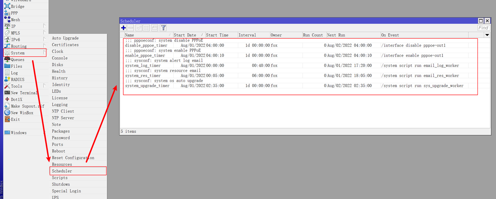
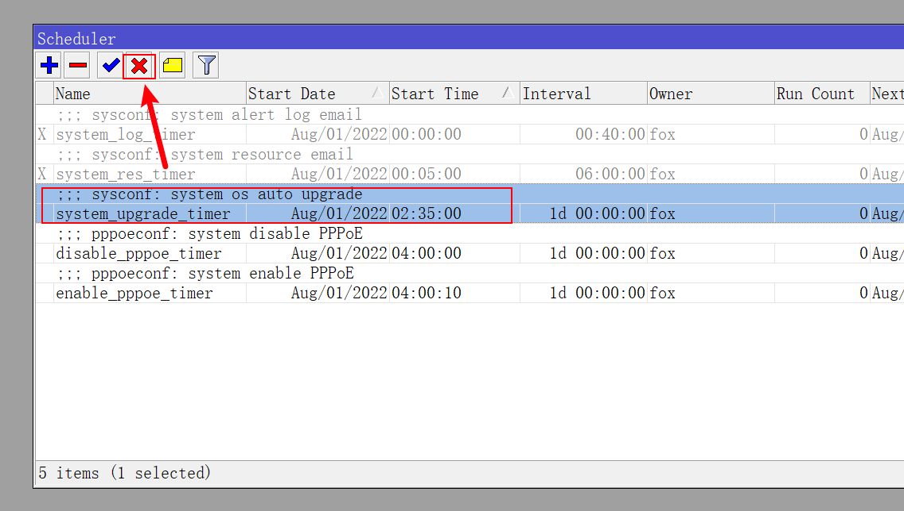

## 0.前景提要

在上一篇教程《[4.系统参数调整](./4.系统参数调整.md)》中，我们对系统的服务、NTP、系统账户等内容进行了一些调整。  

接下来我们使用 RouterOS 的定时器以及脚本功能实现一些自动化操作。 

在正式开始之前需要做一些准备工作：

- 对于使用 Mikrotik 原生 RouterOS 的硬路由，自动更新脚本请查阅 [Fox_ROS_Native_Sys_Upgrade_Worker.conf](./src/Fox_ROS_Native_Sys_Upgrade_Worker.conf) 
- 对于使用 CHR 版本 RouterOS 的软路由，自动更新脚本请查阅 [Fox_ROS_CHR_Sys_Upgrade_Worker.conf](./src/Fox_ROS_CHR_Sys_Upgrade_Worker.conf)
- 使用系统发送邮件功能，需要准备一个邮箱并开启 `SMTP` 服务，推荐使用 QQ 邮箱或 163 邮箱，本文以 163 邮箱作为演示
    - 系统日志邮件脚本，请查阅 [Fox_ROS_Email_Log_Worker.conf](./src/Fox_ROS_Email_Log_Worker.conf)
    - 系统资源邮件脚本，请查阅 [Fox_ROS_Email_Res_Worker.conf](./src/Fox_ROS_Email_Res_Worker.conf)

## 1.定时器和脚本初始化

定时器和脚本配置较为复杂，所以推荐使用 SSH 工具在 RouterOS 的命令行环境下进行配置。  

在前篇文章中，我们不仅新建了一个系统管理员账号，同时在修改系统参数过程中对 SSH 服务进行过调整。  

如果修改过 SSH 服务的端口，在使用 `ssh` 命令登录 RouterOS 时，需要带上端口号。  

使用 **新的** 系统管理员账户进行登录：

```bash
## 使用新管理员账户 fox 进行 ssh 登录
ssh fox@172.16.1.1

## 修改了 SSH 服务端口时的 ssh 登录
## 演示端口号为 5022 
ssh fox@172.16.1.1 -p 5022
```

RouterOS 的定时器将会创建 5 个，分别为：
1. 定时触发系统日志解析脚本
2. 定时触发系统资源收集脚本
3. 定时触发系统自动更新脚本
4. 定时断开 PPPoE 连接
5. 定时重连 PPPoE 连接

RouterOS 的脚本将会创建 3 个，分别为：
1. 系统日志解析脚本
2. 系统资源收集脚本
3. 系统自动更新脚本

在 RouterOS 的命令行环境下，将以下命令一次性全部粘贴到终端工具中即可初始化定时器和脚本：

```bash
/system scheduler

add comment="sysconf: system alert log email" interval=40m name=system_log_timer on-event="/system script run email_log_worker" policy=read,write,policy,test start-time=00:00:00
add comment="sysconf: system resource email" interval=6h name=system_res_timer on-event="/system script run email_res_worker" policy=read,write,policy,test start-time=00:05:00

add comment="sysconf: system os auto upgrade" interval=1d name=system_upgrade_timer on-event="/system script run sys_upgrade_worker" policy=reboot,read,write,policy,password start-time=02:35:00

add comment="pppoeconf: system disable PPPoE" interval=1d name=disable_pppoe_timer on-event="/interface disable pppoe-out1" policy=write start-time=04:00:00
add comment="pppoeconf: system enable PPPoE" interval=1d name=enable_pppoe_timer on-event="/interface enable pppoe-out1" policy=write start-time=04:00:10

/system script

add comment="sysconf: system alert log email" dont-require-permissions=no name=email_log_worker policy=read,write,policy,test source=""
add comment="sysconf: system resource email" dont-require-permissions=no name=email_res_worker policy=read,write,policy,test source=""

add comment="sysconf: system os auto upgrade" dont-require-permissions=no name=sys_upgrade_worker policy=reboot,read,write,policy,password source=""
```

如果这段代码不好复制，请查阅文件 [Fox_ROS_Schedule_Script.conf](./src/Fox_ROS_Schedule_Script.conf) 进行复制。  

其中 `interval` 参数为定时器执行周期，`start-time` 参数为每天的触发时刻。  

命令执行完毕后，打开 Winbox ，点击左侧导航 `System` 菜单的子菜单 `Scheduler` ，可以看到已有 5 个定时器：  



如果需要禁用某个定时器，使用鼠标 **单击** 选中定时器，点击 `Disable` 按钮进行禁用：



## 2.完善系统更新脚本

点击 Winbox 左侧导航 `System` 菜单的子菜单 `Scripts` ，可以看到已有 3 个脚本：


但脚本条目均为红色，因为之前的命令只设置了脚本的基本参数，还未添加脚本具体内容。  

根据所使用的 RouterOS 版本不同，从给原生硬件用的 [Fox_ROS_Native_Sys_Upgrade_Worker.conf](./src/Fox_ROS_Native_Sys_Upgrade_Worker.conf) 和给 CHR 软路由用的 [Fox_ROS_CHR_Sys_Upgrade_Worker.conf](./src/Fox_ROS_CHR_Sys_Upgrade_Worker.conf) 两个更新脚本中选择一个，并复制其内容。  

鼠标 **双击** 系统自动更新脚本 `sys_upgrade_worker` ，进入脚本配置界面，在 `Source` 处粘贴脚本内容：


脚本粘贴完成后， `sys_upgrade_worker` 脚本将转变为正常状态：


## 3.系统邮件通知

### 3.1.准备发信邮箱

RouterOS 支持使用 `SMTP` 协议进行邮件发送，推荐使用国内的QQ邮箱或163邮箱。  

需要说明的是，这里使用邮箱主要在发送 **系统日志信息** 和 **系统资源信息** ，如果无需邮件发送功能，可以跳过本段内容。