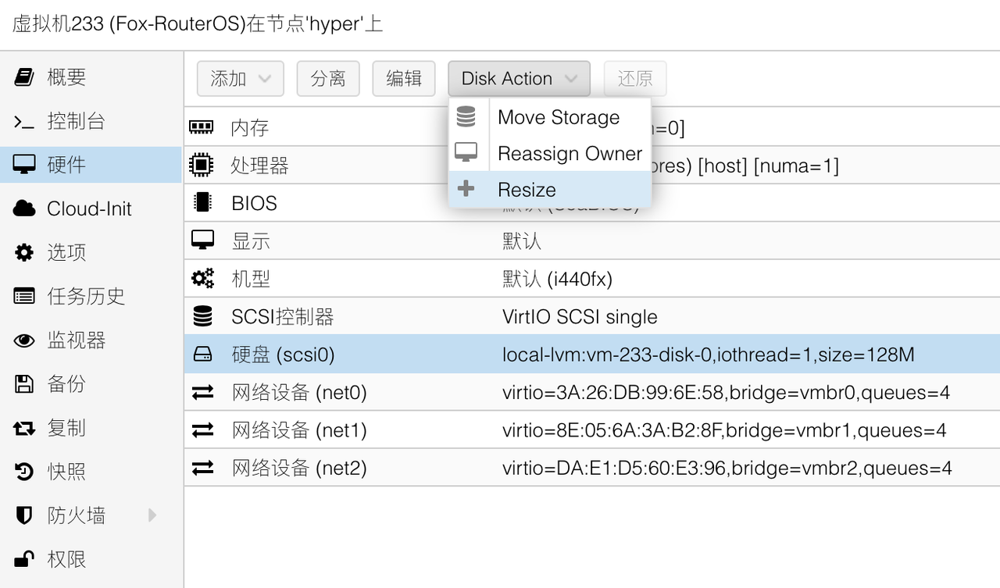

## 前期准备工作
访问RouterOS的官网 [Mikrotik](https://mikrotik.com/download) 下载 Winbox 和 CHR 版本的固件，并一同下载固件的校验文件。


## 创建 RouterOS 的虚拟机

### 常规

登录到PVE后台后，进入新建虚拟机流程，并打开高级选项。  
节点即本机，VM ID 和名称可以自由定义。  


### 操作系统

操作系统类别选择“Linux”、内核版本“5.x - 2.6 Kernel”即可，且无需使用引导介质。


### 系统

系统部分需要修改一项内容，SCSI控制器选择“VirtIO SCSI single”。


### 磁盘

磁盘部分，为了避免后续有多块磁盘，此处选择删掉所有的磁盘。


### CPU

根据设备的CPU资源来定义RouterOS的CPU虚拟资源。  
CPU类别选择“host”，核心根据您物理CPU核心数进行酌情设置，推荐启用 **NUMA** 。  


### 内存

内存一般2G足够使用，关闭 Ballooning 设备选项。


### 网络

网络处需要注意，此页设置只能添加一个网络设备，而网络设备的添加顺序将和 RouterOS 内部显示的网卡顺序一致。  
因此我们此处先仅添加 WAN 对应的网口（此处为 vmbr0 ），模型选择“VirtIO”，并取消勾选防火墙选项。  
对于使用硬件直通的小伙伴，可以根据实际情况来修改此处网络设备选项。  
推荐在 **Multiqueue** 处根据前面设置的 CPU 数量进行网卡多队列设置，设置比例为 1:1 。  
即有 n 个 CPU 核心，此处多队列也设置为 n 。  


### 确认

接下来查看设置总览，确认无误，即可点击“完成”。


## 调整虚拟机硬件参数


此时，查看虚拟机详情页，可以看到我们刚才创建的虚拟机。  
去掉 CD/DVD 驱动器后，开始添加需要的网络设备。  


按需添加需要的网络设备，并去掉防火墙，增加网卡多队列选项。示例如下：


## 创建RouterOS硬盘

### 上传 RouterOS 镜像到 PVE

鉴于大家使用的操作系统有Windows、macOS、Linux，因此大家使用的ssh工具可能不同。  
因此此处不演示如何使用sftp工具。  


使用 SSH 工具登录到 PVE 服务器，并进入 tmp 目录，创建一个文件夹：

```bash
# 进入 tmp 目录
cd /tmp

# 创建文件夹
mkdir RouterOS

# 进入文件夹
cd RouterOS

```

将 RouterOS 固件上传到该文件夹中，并检查 hash ：


```bash
# 检查文件是否存在
ls -la

# 计算文件 hash
sha256sum chr-7.3.1.img.zip 

```

确认无误后，开始对镜像进行转换，并导入刚才创建的 RouterOS 虚拟机中。

### 镜像转换

由于上传的镜像为 Zip 压缩格式，因此需要首先对其解压缩。


```bash
# 将固件解压缩
unzip -q chr-7.3.1.img.zip  

```

解压出 RouterOS 的 img 格式的镜像，然后使用 PVE 自带命令行工具，对其进行格式转换：


```bash
# 将 img 格式的镜像转换成 qcow2 格式
qemu-img convert -f raw -O qcow2 chr-7.3.1.img routeros.qcow2

```

得到了大家最为熟悉的 **qcow2** 格式的镜像。

### 镜像导入虚拟机

在创建 RouterOS 虚拟机时，曾指定了 VM ID，演示中为 **“233”** ；该编号后续会用到，大家在参考本文章时，需要注意替换。


```bash
# 将 qcow2 镜像导入虚拟机中
qm importdisk 233 routeros.qcow2 local-lvm

# 输出结果为以下类似内容表示成功
Successfully imported disk as 'unused0:local-lvm:vm-233-disk-0'  

```

 **再次重申，命令中的“233”要替换成您自己的 RouterOS 虚拟机编号。** 

### 调整 RouterOS 虚拟机磁盘设置


在磁盘导入成功后，会发现虚拟机的硬件列表中多出了一块未使用的磁盘设备，鼠标双击该设备进行一些配置调整。


在弹出的对话框中，勾选 “IO thread” 选项，点击“添加”按钮。


此时，磁盘大小为128M，为了方便后续使用，需要对该磁盘空间进行扩容。  
此处扩容后，在 RouterOS 虚拟机 **初次启动** 时，会根据磁盘空间自动扩容安装，所以无需担心。



选中该磁盘，然后点击 “Disk Action” 的 “Resize”：


根据需要，扩容一定量的磁盘空间；我作为演示，仅增加1G的磁盘空间，并点击“调整磁盘大小”。


调整完成后，磁盘容量已被扩容。

