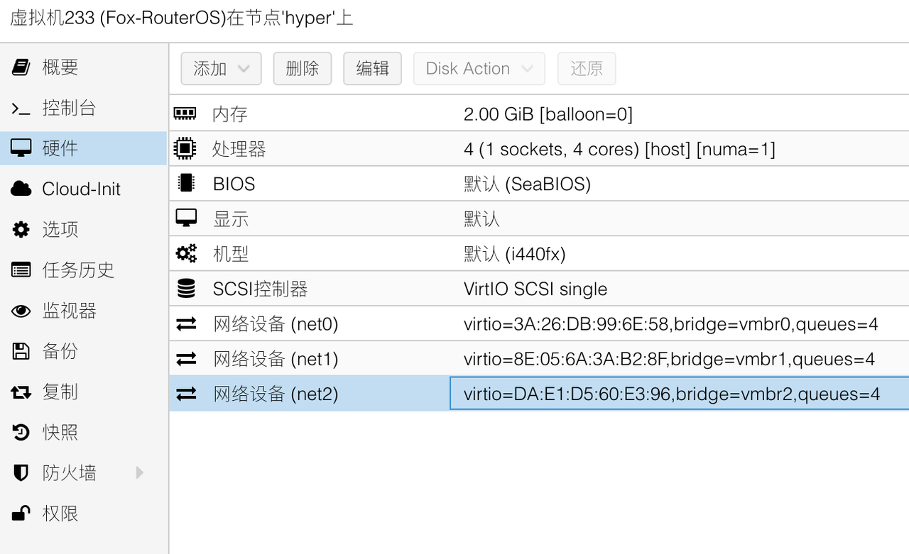

## 前期准备工作
访问RouterOS的官网 [Mikrotik](https://mikrotik.com/download) 下载 Winbox 和 CHR 版本的固件，并一同下载固件的校验文件。

## 创建 RouterOS 的虚拟机

### 常规

登录到PVE后台后，进入新建虚拟机流程，并打开高级选项。  
节点即本机，VM ID 和名称可以自由定义。  

### 操作系统

操作系统类别选择“Linux”、内核版本“5.x - 2.6 Kernel”即可，且无需使用引导介质。

### 系统

系统部分需要修改一项内容，SCSI控制器选择“VirtIO SCSI single”。

### 磁盘

磁盘部分，为了避免后续有多块磁盘，此处选择删掉所有的磁盘。

### CPU

根据设备的CPU资源来定义RouterOS的CPU虚拟资源。  
CPU类别选择“host”，核心根据您物理CPU核心数进行酌情设置，推荐启用 **NUMA** 。  

### 内存

内存一般2G足够使用，关闭 Ballooning 设备选项。

### 网络

网络处需要注意，此页设置只能添加一个网络设备，而网络设备的添加顺序将和 RouterOS 内部显示的网卡顺序一致。  
因此我们此处先仅添加 WAN 对应的网口（此处为 vmbr0 ），模型选择“VirtIO”，并取消勾选防火墙选项。  
对于使用硬件直通的小伙伴，可以根据实际情况来修改此处网络设备选项。  
推荐在 **Multiqueue** 处根据前面设置的 CPU 数量进行网卡多队列设置，设置比例为 1:1 。  
即有 n 个 CPU 核心，此处多队列也设置为 n 。  

### 确认

接下来查看设置总览，确认无误，即可点击“完成”。

## 调整虚拟机硬件参数

此时，查看虚拟机详情页，可以看到我们刚才创建的虚拟机。  
去掉 CD/DVD 驱动器后，开始添加需要的网络设备。  

按需添加需要的网络设备，并去掉防火墙，增加网卡多队列选项。示例如下：

